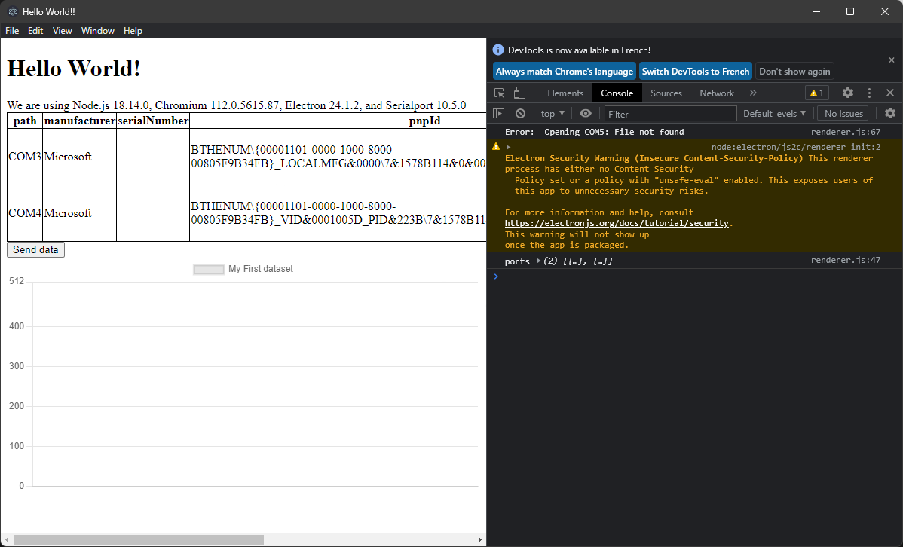

# electron2arduino
Ce dépôt contient un projet minimaliste pour configurer une interface graphique electron pour contrôler et obtenir des informations d'un périphérique de port série.
Il existe de nombreuses alternatives pour faire cela, comme Processing ou Node-RED, mais Electron est beaucoup plus standard car il tire parti de la puissance de JavaScript, HTML, CSS et Node.js.
Cet exemple a été construit en utilisant GPT-4 et GitHub Copilot.

## 1. Installez nodejs
Vous pouvez télécharger nodejs à partir de [ici](https://nodejs.org/fr/download/). J'ai utilisé la version LTS. (v16.15.1)
Pour vérifier si nodejs est installé, ouvrez un terminal et tapez :
```bash
node -v
```

## 2. Installez electron
Pour installer electron et electron-builder, créez un répertoire et ouvrez un terminal dedans. Ensuite, tapez :
```bash
npm init
npm install electron --save-dev
npm install -g electron-builder
```
Cette ligne installera electron uniquement dans ce répertoire et est défini comme une dépendance de développement.
La deuxième ligne installera electron-builder globalement.

## 3. Installez les dépendances
Pour installer les dépendances, tapez :
```bash
npm install chart.js@3 serialport tableify --save
```
Cette ligne installera chart.js (seule la version 3 fonctionne avec electron), serialport (pour communiquer avec le périphérique série) et tableify (cette bibliothèque convertira une liste d'objets JavaScript, ici les ports série disponibles, en tableau HTML) dans ce répertoire et est définie comme une dépendance.

## 4. Créez le projet electron
Modifiez le fichier package.json et ajoutez les lignes suivantes :
```json
"main": "main.js",
"scripts": {
    "test": "echo \"Error: no test specified\" && exit 1",
    "start": "electron .",
    "build": "electron-builder"
  },
```
Le fichier package.json doit ressembler à ceci :
```json
{
  "name": "electron2arduino",
  "version": "1.0.0",
  "description": "XXX",
  "main": "main.js",
  "scripts": {
    "test": "echo \"Error: no test specified\" && exit 1",
    "start": "electron .",
    "build": "electron-builder"
  },
  "author": "XXX",
  "license": "XXX",
  "devDependencies": {
    "electron": "^24.1.2"
  },
  "dependencies": {
    "chart.js": "^3.9.1",
    "serialport": "^10.5.0",
    "tableify": "^1.1.1"
  }
}
```
## 5 Créez le fichier main.js
Ensuite, créez le fichier main.js et ajoutez les lignes suivantes :
```javascript
// main.js

// Modules to control application life and create native browser window
const { app, BrowserWindow } = require('electron')
const path = require('path')

console.log("Hello from main.js");

const createWindow = () => {
    // Create the browser window.
    const mainWindow = new BrowserWindow({
        width: 800,
        height: 600,
        webPreferences: {
            nodeIntegration: true,
            contextIsolation: false,
            preload: path.join(__dirname, 'preload.js')
        }
    })
    // Open the DevTools of Chrome
    mainWindow.webContents.openDevTools();


    // and load the index.html of the app.
    mainWindow.loadFile('index.html')

    // Open the DevTools.
    // mainWindow.webContents.openDevTools()
}

// This method will be called when Electron has finished
// initialization and is ready to create browser windows.
// Some APIs can only be used after this event occurs.
app.whenReady().then(() => {
    createWindow()

    app.on('activate', () => {
        // On macOS it's common to re-create a window in the app when the
        // dock icon is clicked and there are no other windows open.
        if (BrowserWindow.getAllWindows().length === 0) createWindow()
    })
})

// Quit when all windows are closed, except on macOS. There, it's common
// for applications and their menu bar to stay active until the user quits
// explicitly with Cmd + Q.
app.on('window-all-closed', () => {
    if (process.platform !== 'darwin') app.quit()
})

// In this file you can include the rest of your app's specific main process
// code. You can also put them in separate files and require them here.
```

## 6 Créez le fichier index.html
Ensuite, créez le fichier index.html et ajoutez les lignes suivantes :
```html
<!DOCTYPE html>
<html>

<head>
    <meta charset="UTF-8">
    <title>Hello World!!</title>
    <style>
        table { border-collapse: collapse; }
        table, th, td { border: 1px solid black; }
    </style>
</head>

<body>
    <h1>Hello World!</h1>

    We are using Node.js <span id="node-version"></span>, Chromium <span id="chrome-version"></span>, Electron <span id="electron-version"></span>, and Serialport <span id="serialport-version"></span>

    <div id="error"></div>
    <div id="ports"></div>
    <button id="sendData">Send data</button>
    <label id="receivedData"></label>
    <canvas id="myChart"></canvas>
</body>
<script src="./renderer.js"></script>

</html>
```

## 7 Créez le fichier renderer.js
Ensuite, créez le fichier renderer.js et ajoutez les lignes suivantes :
```javascript
// This file is required by the index.html file and will
// be executed in the renderer process for that window.
// All of the Node.js APIs are available in this process.

const { SerialPort } = require('serialport')
const tableify = require('tableify')
const Chart = require('chart.js');

// get the objects for chart.js real time data
const canvas = document.getElementById('myChart');
const ctx = canvas.getContext('2d');
// Initialisation of the chart
var vector = [];
var t = [];
var config = {
  type: 'line',
  data: {
    labels: t,
    datasets: [{
      label: 'My First dataset',
      data: vector,
      fill: false,
    }]
  },
  options: {
    responsive: true,
    animation : false,
    scales: {
      y:{
          max: 512,
          min: 0,
      }
    }
  },
};
var c = new Chart(ctx, config);

// list all serial port
async function listSerialPorts() {
  await SerialPort.list().then((ports, err) => {
    if (err) {
      document.getElementById('error').textContent = err.message
      return
    } else {
      document.getElementById('error').textContent = ''
    }
    console.log('ports', ports);

    if (ports.length === 0) {
      document.getElementById('error').textContent = 'No ports discovered'
    }

    tableHTML = tableify(ports)
    document.getElementById('ports').innerHTML = tableHTML
  })
}

// Set a timeout that will check for new serialPorts after 2 seconds.
setTimeout(listSerialPorts, 2000);

// Create a serial port (replace the serial port you want to use)
const port = new SerialPort({
  path: 'COM5',
  baudRate: 115200,
}, (err) => {
  if (err) {
    return console.log('Error: ', err.message)
  }
});

// this event listener is called when the button sendData is clicked
document.getElementById('sendData').addEventListener('click', () => {
  port.write('H', (err) => {
    if (err) {
      return console.log('Error on write: ', err.message)
    }
    console.log('message written')
  })
});

// this loop asks periodically for data
window.setInterval(() => {
  port.write('H', (err) => {
    if (err) {
      return console.log('Error on write: ', err.message)
    }
    console.log('message written')
  })
}, 10);

// this event listener is called when the serial port receives data
port.on('readable', function () {
  let a = port.read().toString().split(',');
  port.flush();
  let b = parseInt(a[0]);
  console.log(b);
  vector.push(b);
  if(t.length==0){
    t.push(0);
  }else{
    t.push(t[t.length-1]+1);
  }
  document.getElementById('receivedData').textContent = b;
  if (vector.length > 100) {
    vector.shift();
    t.shift();
  }
  config.data.datasets[0].data = vector;
  config.data.labels = t;
  c.update();
})
```

## 8 Créez le fichier preload.js
Ensuite, créez le fichier preload.js et ajoutez les lignes suivantes :
```javascript
// All of the Node.js APIs are available in the preload process.
// It has the same sandbox as a Chrome extension.
window.addEventListener('DOMContentLoaded', () => {
    for (const versionType of['chrome', 'electron', 'node']) {
        document.getElementById(`${versionType}-version`).innerText = process.versions[versionType]
    }

    document.getElementById('serialport-version').innerText = require('serialport/package').version

})
```

## 9 Programmez l'Arduino
Ensuite, programmez l'Arduino avec le code suivant, qui est un exemple de la librairie Arduino SerialCallResponseASCII avec un port série à 115200 bauds

```c++
/*
  Serial Call and Response in ASCII
  Language: Wiring/Arduino

  This program sends an ASCII A (byte of value 65) on startup and repeats that
  until it gets some data in. Then it waits for a byte in the serial port, and
  sends three ASCII-encoded, comma-separated sensor values, truncated by a
  linefeed and carriage return, whenever it gets a byte in.

  The circuit:
  - potentiometers attached to analog inputs 0 and 1
  - pushbutton attached to digital I/O 2

  created 26 Sep 2005
  by Tom Igoe
  modified 24 Apr 2012
  by Tom Igoe and Scott Fitzgerald
  Thanks to Greg Shakar and Scott Fitzgerald for the improvements

  This example code is in the public domain.

  https://www.arduino.cc/en/Tutorial/BuiltInExamples/SerialCallResponseASCII
*/

int firstSensor = 0;    // first analog sensor
int secondSensor = 0;   // second analog sensor
int thirdSensor = 0;    // digital sensor
int inByte = 0;         // incoming serial byte

void setup() {
  // start serial port at 115200 bps and wait for port to open:
  Serial.begin(115200);
  while (!Serial) {
    ; // wait for serial port to connect. Needed for native USB port only
  }


  pinMode(2, INPUT);   // digital sensor is on digital pin 2
  establishContact();  // send a byte to establish contact until receiver responds
}

void loop() {
  // if we get a valid byte, read analog ins:
  if (Serial.available() > 0) {
    // get incoming byte:
    inByte = Serial.read();
    // read first analog input:
    firstSensor = analogRead(A0);
    // read second analog input:
    secondSensor = analogRead(A1);
    // read switch, map it to 0 or 255
    thirdSensor = map(digitalRead(2), 0, 1, 0, 255);
    // send sensor values:
    Serial.print(firstSensor);
    Serial.print(",");
    Serial.print(secondSensor);
    Serial.print(",");
    Serial.println(thirdSensor);
  }
}

void establishContact() {
  while (Serial.available() <= 0) {
    Serial.println("0,0,0");   // send an initial string
    delay(300);
  }
}
```


## 10 executer l'application
Pour exécuter l'application, tapez la commande suivante dans le terminal:
```bash
npm start
```
Une fenêtre comme celle-ci devrait s'ouvrir


## 11 Créer l'application
Pour créer l'application, tapez la commande suivante dans le terminal:
```bash
npm run build
```
Un dossier dist devrait être créé. Dans ce dossier, vous trouverez un fichier nommé electron-quick-start.exe. Vous pouvez l'exécuter pour lancer l'application.


